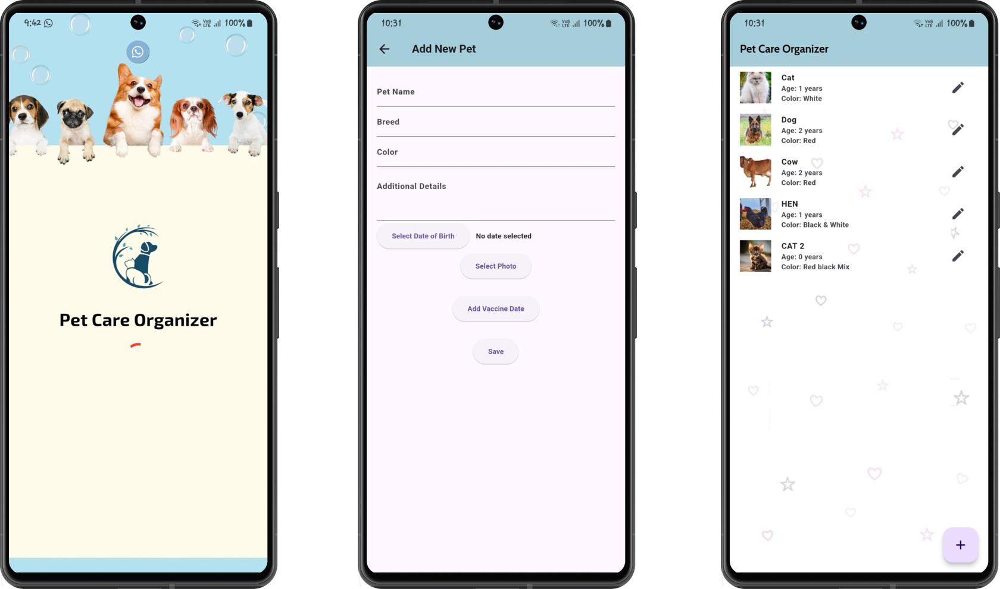
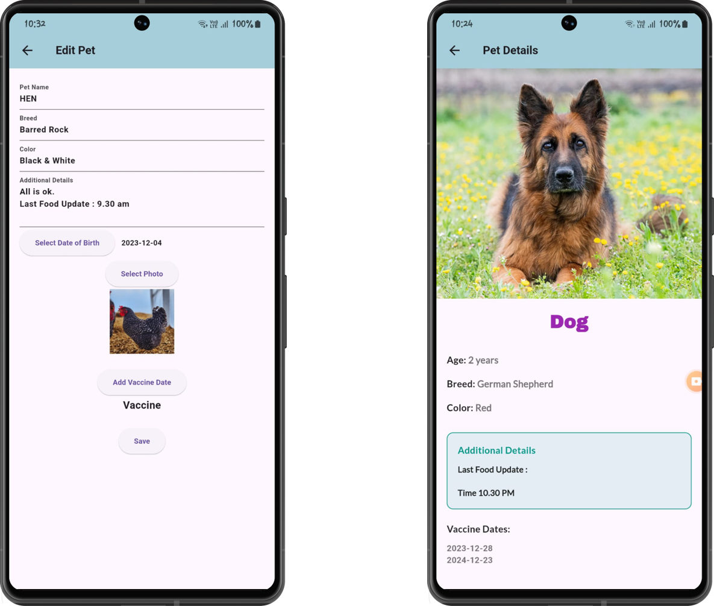

# pet_care_app

# **A Simple Pet Care App.**

## Getting Started

# **Description About My App::**

This is a simple PetCare App, similar to a note-taking app,
where all details about pets are saved according to their vaccination dates.
- [Lab: Write your first Flutter app](https://docs.flutter.dev/get-started/codelab)
- [Cookbook: Useful Flutter samples](https://docs.flutter.dev/cookbook)

For help getting started with Flutter development, view the
[online documentation](https://docs.flutter.dev/), which offers tutorials,
samples, guidance on mobile development, and a full API reference.
